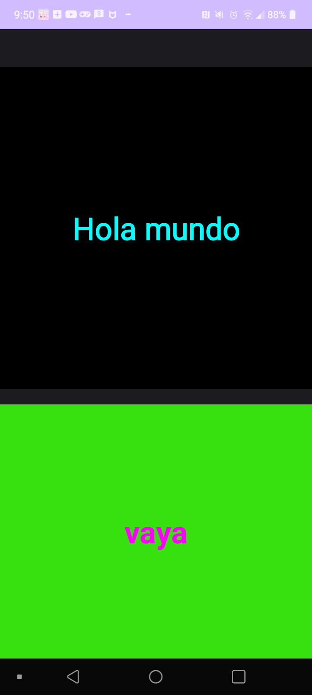

# HelloWorld

# Primeros pasos

Primero hemos estado viendo como funciona el entorno de desarrollo Android Studio como crear un proyecto, en que lenguaje de programacion lo queremos,elegir un activity, hemos creado un emulador para ver como se ejecutaran las aplicaciones que vamos haciendo, tambien vimos que tambien se puede ver las aplicaciones que vamos haciendo en nuestro movil, para ello tenemos que desbloquear las opciones de desarrollador, vamos a los ajustes de nuestro movil despues a Acerca del telefono y luego ir a Informacion de Software y luego seleccionar varias veces numero de compilacion y ya tendriamos las opciones de desarrollador. Ahora activamos la opcion depuracion USB, ponemos un cable USB en nuestro movil y ya la aplicacion se instalara en nuestro movil automaticamente y se ejecutara.

Yo he tenido un problema que el entorno de desarrollo y es que no me reconocia mi movil, investigue si el cable USB que usaba estaba en mal estado o que si tenia que reiniciar mi movil antes de conectarlo a mi portátil, hasta vi que habia una opcion que era Thoubleshoot device connection que consiste en buscar dispositivos reconocibles y vi de que aparece dispositivos que no se pueden reconocer y ahi salia mi movil, asi que investigue que es lo que pasaba y encontre una solucion, tenia que instalar drives de USB de mi movil especifico en mi portartil que es un LG, lo instale y ya me lo reconoce y me deja instalar aplicaciones en mi movil.

# Interfaz

Vimos tambien como es la interfaz de nuestra aplicacion que seria en activity_main.xml, vimos el componente TextView que es una caja de texto no editable, vimos tambien que con el codigo del xml podemos editar algunas opciones como que texto tendra, el posicionamiento del texto, su tamaño, su color, el color de fondo, su estilo, el tamaño. Tambien vimos como ponerle un id. Tambien vimos algunos xml de recursos que son color.xml y string.xml, el color.xml que podemos definir los colores que utilizaran en nuestra aplicación mediante elementos XML asi podemos reutilizar colores cuando lo necesitemos. Y el string.xml se utiliza para definir y gestionar las cadenas de texto utilizadas en nuestra aplicacion esto facilita la localización, la reutilización y la personalización del texto de la aplicación.

En el MainActivity.java pusimos objetos de tipo TextView para poner un texto de inicio y otro texto para el final, y usamos el metodo findViewById para buscar por id los TextView que hemos definido antes, como es un recurso ponemos R.id.TvInicial. y luego para cambiar el color de los TextView cuando se ejecuta la aplicacion usamos el metodo setTextColor ponemos la clase Color y luego seleccionamos el color que queremos poner a los TextView.

# Poner un icono

Vimos tambien de como poner un icono para nuestra aplicacion, para ello teniamos que crear una Image Asset, pero primero teniamos que eliminar las carpetas que tenian el icono por defecto, y luego cuando creamos nuestro icono se nos creara la mismas carpetas que hemos borrado pero esta vez con el icono que hemos puesto, cada una de estas carpetas tiene un icono con un tamaño diferente para dispositivo diferente de Android. Vamos a Image Asset y nos creamos nuestro icono, nos descargamos una imagen en una pagina web donde podemos descargar iconos gratuitos, lo seleccionamos se nos creara las carpetas que dije antes y si ejecutamos nuestra aplicacion se mostrara el icono que hemos creado.

# JavaDoc

Tambien vimos el JavaDoc es una herramienta que se usa para crear documentación clara y legible para las clases, métodos y variables que forman parte de nuestro codigo. Con el JavaDoc genera documentación automáticamente a partir del código fuente en lenguaje Java, podriamos añadir comentarios en nuestro codigo, tambien etiquetas especificas como @param para describir parámetros, @return para describir el valor de retorno, @see para proporcionar referencias a otras clases o métodos relacionados. Para ello vamos a Tools y le damos a Generate JavaDoc, se creara en la carpeta app de nuestro proyecto, pero cuando intentamos generar el JavaDoc nos daba un error, lo que pasaba era que una libreria que no encontraba es decir un android.jar lo necesitaba para poder crear el JavaDoc, investigamos y en Windows encontramos la ruta de esa libreria que en mi caso era esta ruta:

C:\Users\anton\AppData\Local\Android\Sdk\platforms\android-33\android.jar

Despues teniamos que añadir esta ruta como una dependencia, nos vamos a File luego a Project Structure, despues a Dependencies le damos al + y seleccionamos JAR/AAR Dependency, y ahi podemos la ruta que encontramos el android.jar, aplicamos los cambios y le damos a OK , compilamos y luego a continuacion funciono ya se genero el JavaDoc y automaticamente nos sale el JavaDoc que hemos generado en nuestro navegador predeterminado.

Pero despues hubo otro problema, que al ejecutar la aplicacion daba un error era que ya existe un archivo llamado 'AndroidManifest.xml' dentro del archivo APK de nuestra aplicacion, y no se puede sobrescribirlo. Probe una solucion que era borrar la version anterior del APK y luego hacer un Build y un Clear Project para generar una nueva APK, pero no funciono asi que la solucion que vimos en clase era comentar una linea del build.gradle.ktd de la carpeta app, despues de eso la aplicacion volvio a funcionar.

# .gitignore

Tambien vimos

# Subir nuestro proyecto al repositorio de GitHub

Tambien vimos como subir nuestro proyecto HelloWorld a un repositorio de GitHub, primero nos creamos una cuenta, creamos un repositorio con un nombre, seleccioamos si lo queremos publico o privado en mi caso lo puse como publico y por ultimo pulsamos Create repository y ya tendriamos un repositorio remoto para poner nuestro proyecto de Android Studio

Ahora para subir nuestro proyecto al repositorio que hemos creado, tenemos que hacer una serie de comando de Git en la terminal del entorno de desarrollo, el orden es la siguiente:

- git init. Este comando inicializa un nuevo repositorio Git local en el directorio actual. Después de ejecutar este comando, Git comenzará a rastrear los cambios en los archivos de ese directorio.

# Captura de pantalla de la aplicacion en mi movil

Vi un metodo para poner una captura de pantalla en el README.md y es la siguiente:

- Primero subimos a nuestro repositorio la imagen que queremos usar para ponerlo en el README.md, la subi a la rama master
- Despues usamos la sintaxis Markdown para incluir la imagen que hemos subido a nuestro repositorio. Empezamos con la exclamacion ! y entre llaves ponemos un texto descriptivo que se mostrara si la imagen no se puede cargar o si se pasa el raton por encima de la imagen, y por ultimo entre parentesis la imagen que esta subida en el repositorio, si la imagen se encuentra en la raíz de nuestro repositorio simplemente ponemos el nombre de la imagen. Si estuviara en otra carpeta la imagen seria carpeta/imagen.png. Despues le damos a Commit changes y ya tendriamos una imagen en nuestro README.md

